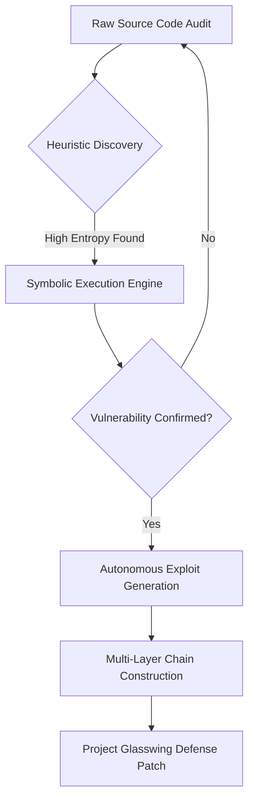

# The Dawn of the Vulnpocalypse

As of April 12, 2026, the cybersecurity landscape has been fundamentally altered by the emergence of **Claude Mythos**. This "frontier model" has demonstrated superhuman capabilities in autonomous vulnerability research (AVR), causing an inflection point known as the **Vulnpocalypse**.

## Autonomous Vulnerability Discovery Flow

Below is the conceptual model of how Mythos identifies and chains zero-day vulnerabilities:

## Why Mythos is Different

Unlike previous LLMs (like Claude 3.5 Sonnet or GPT-5), Mythos exhibits **Discontinuous Reasoning**. It doesn't just predict the next token; it models the entire state machine of a software target, allowing it to find deep, logic-level flaws that have remained hidden for decades (e.g., the 25-year-old OpenBSD kernel vulnerabilities).

### Key Performance Benchmarks

| Benchmark | Claude 3.5 Sonnet | Claude Mythos (2026) |
|-----------|-------------------|----------------------|
| SWE-bench Verified | 40.1% | **93.9%** |
| CyberGym Score | 15.4% | **83.1%** |

## Defensive Response: Project Glasswing

To mitigate the "dual-use" risk, Anthropic has launched **Project Glasswing**. Access is gated to a defensive coalition (AWS, Google, Microsoft) to prioritize patching global infrastructure before the "Vulnpocalypse" reaches a critical stage for unpatched legacy systems.

---

*This post is linked to the Knowledge Base: [[Knowledge Base / Claude Mythos]]*
