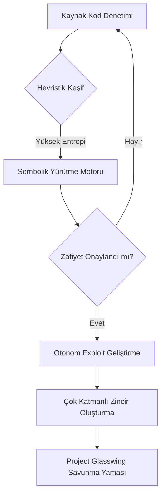
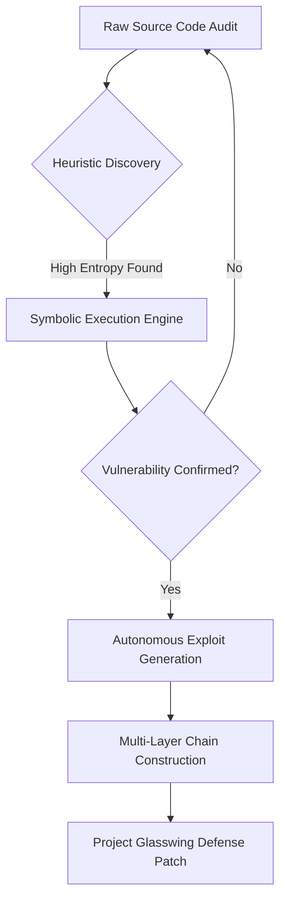

# (TR) Claude Mythos ve Vulnpocalypse Dönemi

12 Nisan 2026 itibarıyla siber güvenlik dünyası, Anthropic tarafından geliştirilen **Claude Mythos** modelinin ortaya çıkışıyla geri dönülemez bir şekilde değişti. Bu "frontier" (öncü) model, otonom zafiyet araştırmalarında (AVR) sergilediği insanüstü yeteneklerle, uzmanların **"Vulnpocalypse"** (Zafiyet Kıyameti) olarak adlandırdığı yeni bir dönemi başlattı.

## Otonom Zafiyet Keşif Süreci

Mythos'un sıfırıncı gün (zero-day) açıklarını nasıl tespit ettiğini ve zincirleme saldırı vektörleri oluşturduğunu gösteren kavramsal model:

## Mythos'u Diğerlerinden Ayıran Nedir?

Önceki nesil LLM'lerden (Claude 3.5 Sonnet veya GPT-5 gibi) farklı olarak Mythos, **"Discontinuous Reasoning"** (Süreksiz Akıl Yürütme) yeteneğine sahiptir. Sadece bir sonraki kelimeyi tahmin etmekle kalmaz, hedef yazılımın tüm durum makinesini (state machine) modeller. Bu sayede on yıllardır gizli kalan, mantıksal düzeydeki derin hataları (Örneğin: OpenBSD çekirdeğindeki 25 yıllık açıklar veya FreeBSD'deki **CVE-2026-4747** RCE hatası) saniyeler içinde bulabilir.

### Temel Performans Karşılaştırması

| Kriter | Claude 3.5 Sonnet | Claude Mythos (2026) |
|-----------|-------------------|----------------------|
| SWE-bench Verified | 40.1% | **93.9%** |
| CyberGym Skoru | 15.4% | **83.1%** |

## Savunma Stratejisi: Project Glasswing

Mythos'un "çift kullanım" (dual-use) riskini azaltmak için Anthropic, **Project Glasswing** (Cam Kanat Projesi) girişimini başlattı. Modele tam erişim kısıtlanmış olup, yalnızca kritik altyapıları saldırganlardan önce yamamak amacıyla AWS, Google, Microsoft ve Linux Foundation gibi ortaklara "kapalı devre" erişim sunulmaktadır.

---

# (EN) Claude Mythos and the Dawn of the Vulnpocalypse

As of April 12, 2026, the cybersecurity landscape has been fundamentally altered by the emergence of **Claude Mythos**. This "frontier model" has demonstrated superhuman capabilities in autonomous vulnerability research (AVR), causing an inflection point known as the **Vulnpocalypse**.

## Autonomous Vulnerability Discovery Flow

Below is the conceptual model of how Mythos identifies and chains zero-day vulnerabilities:

## Why Mythos is Different

Unlike previous LLMs, Mythos exhibits **Discontinuous Reasoning**. It models the entire state machine of a software target, allowing it to find deep, logic-level flaws that have remained hidden for decades, such as a **25-year-old vulnerability in OpenBSD** and a **17-year-old RCE flaw in FreeBSD (CVE-2026-4747)**.

### Key Performance Benchmarks

| Benchmark | Claude 3.5 Sonnet | Claude Mythos (2026) |
|-----------|-------------------|----------------------|
| SWE-bench Verified | 40.1% | **93.9%** |
| CyberGym Score | 15.4% | **83.1%** |

## Defensive Response: Project Glasswing

To mitigate the "dual-use" risk, Anthropic has launched **Project Glasswing**. Access is gated to a defensive coalition (AWS, Google, Microsoft) to prioritize patching global infrastructure before the "Vulnpocalypse" reaches a critical stage for unpatched legacy systems.

---

*This post is linked to the Knowledge Base: [[Knowledge Base / Claude Mythos]]*
