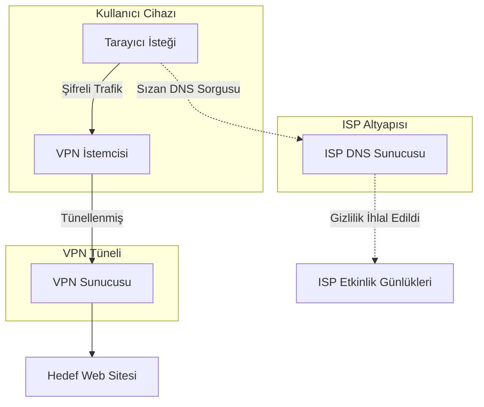
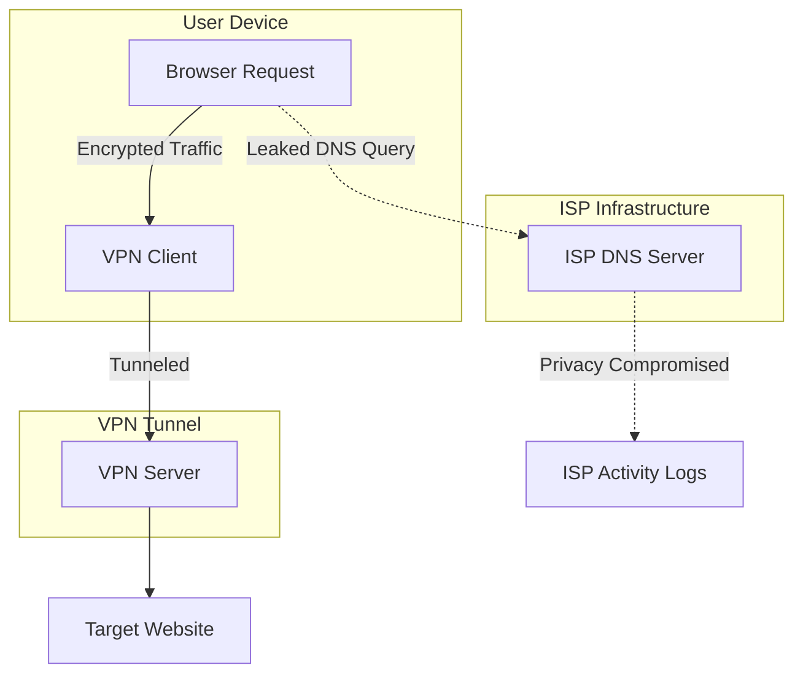

## Türkçe: Sessiz Gizlilik Katili

Dijital gizlilik dünyasında, Sanal Özel Ağlar (VPN) genellikle nihai kalkan olarak görülür. Trafiğimizi şifrelemek ve kimliğimizi meraklı gözlerden, özellikle de İnternet Servis Sağlayıcılarımızdan (ISP) gizlemek için onlara güveniriz. Ancak, en güçlü şifrelemeyi bile işe yaramaz hale getirebilecek sinsi ve genellikle gözden kaçan bir güvenlik açığı vardır: **DNS Sızıntısı**.

### DNS Sızıntısı Nedir?

Tarayıcınıza `google.com` gibi bir adres yazdığınızda, bilgisayarınızın bu ismi makine tarafından okunabilir bir IP adresine dönüştürmesi gerekir. Bu işlem Alan Adı Sistemi (DNS) üzerinden yapılır. Normal şartlar altında, bu istekleri ISP'niz yönetir ve bu da onlara ziyaret ettiğiniz her web sitesini görme imkanı tanır.

Bir VPN kullandığınızda, tüm trafiğinizin (bu DNS sorguları dahil) şifreli bir tünel üzerinden VPN sağlayıcısının DNS sunucularına iletilmesi gerekir. DNS sızıntısı, işletim sisteminizin veya belirli bir uygulamanın bu tüneli baypas ederek DNS isteğini doğrudan ISP'nizin sunucularına göndermesiyle oluşur. Sonuç? Trafiğiniz şifrelenmiş olabilir, ancak gittiğiniz yer herkesin görebileceği şekilde ortadadır.

### Sızıntılar Neden Olur?

DNS sızıntılarının nedenleri genellikle işletim sisteminiz ile VPN yapılandırmanız arasındaki teknik uyumsuzluklardır.

1.  **IPv6 Uyumsuzluğu**: Birçok eski VPN tüneli yalnızca IPv4 için tasarlanmıştır. Sisteminiz veya ziyaret ettiğiniz web sitesi IPv6'yı destekliyorsa, işletim sisteminiz DNS sorgusunu VPN tünelinin tamamen görmezden geldiği bir IPv6 bağlantısı üzerinden çözmeye çalışabilir.
2.  **Windows "Akıllı" Özellikleri**: Modern Windows sürümleri (8 ve üzeri), *Akıllı Çoklu Ana Bilgisayar Ad Çözümlemesi* (SMHNR) adlı bir özellik kullanır. Göz atmayı hızlandırmak için Windows, DNS isteklerini tüm kullanılabilir ağ arayüzlerine aynı anda gönderir ve en hızlı yanıtı kabul eder. Genellikle ISP'nizin sunucusu VPN'den daha hızlı yanıt verir ve bu da sızıntıya neden olur.
3.  **Şeffaf DNS Proxy'leri**: Bazı ISP'ler, 53 numaralı porttaki herhangi bir DNS trafiğini kesmek ve kendi sunucularına yönlendirmek için şeffaf proxy'ler kullanır; bu da yapılandırdığınız manuel DNS ayarlarını etkisiz hale getirir.

### Teknik Önleme Stratejileri

Kendinizi korumak, sadece bir VPN'i "açmaktan" daha fazunu gerektirir. Tam DNS bütünlüğünü sağlamak için profesyonel adımlar şunlardır:

*   **DNS'i Zorla (Force-DNS)**: VPN istemcinizin tüm DNS isteklerini kendi sunucularından geçmeye zorlayacak şekilde yapılandırıldığından emin olun. Profesyonel düzeydeki istemciler bunu varsayılan olarak yapar.
*   **Kill Switch (Durdurma Anahtarı)**: Her zaman sistem genelinde bir kill switch etkinleştirin. VPN bağlantınız bir milisaniye için bile kopsa, kill switch işletim sisteminizin varsayılan ISP bağlantısına dönmesini engeller.
*   **Manuel IPv6 Devre Dışı Bırakma**: IPv6'ya açıkça ihtiyacınız yoksa, işletim sistemi düzeyinde devre dışı bırakın. Bu, en yaygın sızıntı vektörlerinden birini ortadan kaldırır.
*   **Şifreli DNS Protokolleri**: DNS-over-HTTPS (DoH) veya DNS-over-TLS (DoT) kullanın. Bu protokoller DNS sorgularınızı uygulama düzeyinde şifreleyerek, VPN tüneli dışına sızsalar bile okunamaz hale getirir.

### Sızıntı Mimarisi

Aşağıda, bir DNS sızıntısının bir VPN tünelinin amaçlanan güvenliğini nasıl baypas ettiğinin görselleştirilmesi yer almaktadır.

---

## English: The Silent Privacy Killer

In the realm of digital privacy, the Virtual Private Network (VPN) is often hailed as the ultimate shield. We trust it to encrypt our traffic and mask our identity from prying eyes, especially our Internet Service Providers (ISPs). However, there is a subtle and often overlooked vulnerability that can render even the most robust encryption useless: the **DNS Leak**.

### What is a DNS Leak?

When you type a URL like `google.com` into your browser, your computer needs to translate that human-readable name into a machine-readable IP address. This is done via the Domain Name System (DNS). Under normal circumstances, your ISP handles these requests, giving them a front-row seat to every website you visit.

When you use a VPN, all your traffic—including these DNS queries—is supposed to be routed through an encrypted tunnel to the VPN provider's DNS servers. A DNS leak occurs when your operating system or a specific application bypasses this tunnel and sends the DNS request directly to your ISP's servers. The result? Your traffic might be encrypted, but your destination is broadcast in plain sight.

### Why Do Leaks Happen?

The causes of DNS leaks are often technical mismatches between your operating system and your VPN configuration. 

1.  **IPv6 Mismatch**: Many legacy VPNs are designed only for IPv4. If your system or the website you are visiting supports IPv6, your OS might attempt to resolve the DNS query over an IPv6 connection, which the VPN tunnel completely ignores, leading it straight to your ISP.
2.  **Windows "Smart" Features**: Modern Windows versions (8 and above) utilize a feature called *Smart Multi-Homed Name Resolution*. To speed up browsing, Windows sends DNS requests to all available network interfaces simultaneously and accepts the fastest response. Often, your ISP's server responds faster than the VPN's, causing a leak.
3.  **Transparent DNS Proxies**: Some ISPs use transparent proxies to intercept any DNS traffic on port 53 and redirect it to their own servers, effectively overriding any manual DNS settings you might have configured.

### Technical Prevention Strategies

Protecting yourself requires more than just "turning on" a VPN. Here are the professional steps to ensure total DNS integrity:

*   **Force-DNS**: Ensure your VPN client is configured to force all DNS requests through its own servers. Professional-grade clients (like Mullvad or IVPN) do this by default.
*   **The Kill Switch**: Always enable a system-wide kill switch. If your VPN connection drops for even a millisecond, the kill switch prevents your OS from defaulting back to the ISP connection.
*   **Manual IPv6 Disabling**: If you don't explicitly need IPv6, disable it at the OS level. This eliminates one of the most common leak vectors.
*   **Encrypted DNS Protocols**: Use DNS-over-HTTPS (DoH) or DNS-over-TLS (DoT). These protocols encrypt your DNS queries at the application level, making them unreadable even if they leak outside the VPN tunnel.

### The Architecture of a Leak

Below is a visualization of how a DNS leak bypasses the intended security of a VPN tunnel.

---

*This post is linked to the Knowledge Base: [[dns-leak]]*
