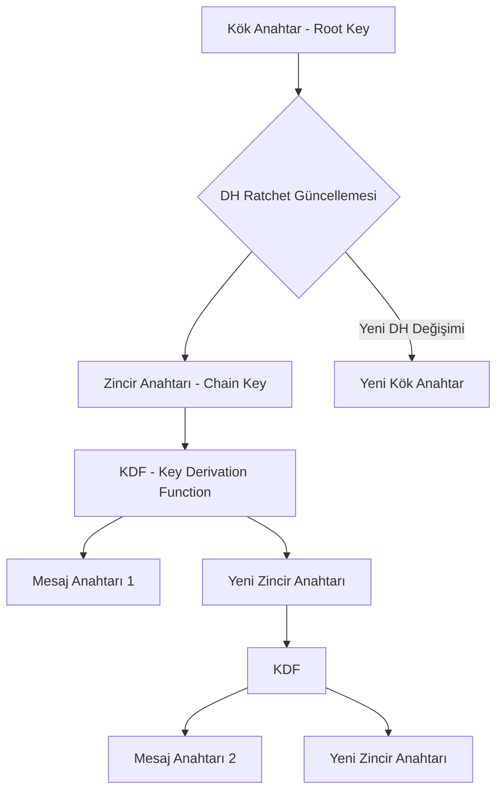
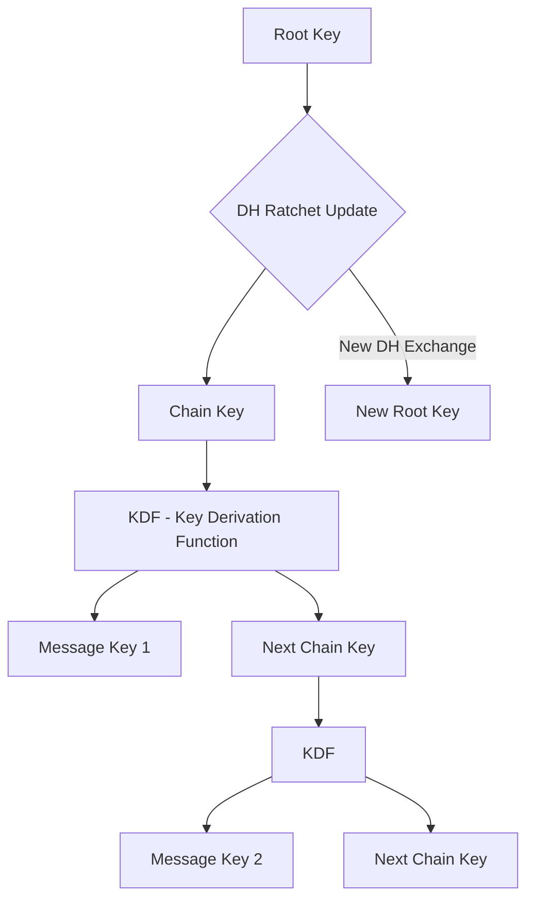

# (TR) Double Ratchet Algoritması: Mesajlarınız Nasıl Güvende Kalıyor?

Günümüzde Signal, WhatsApp ve Google Messages gibi milyarlarca insanın kullandığı mesajlaşma uygulamalarının arkasındaki gizli kahraman, **Double Ratchet (Çift Dişli)** algoritmasıdır. Trevor Perrin ve Moxie Marlinspike tarafından 2013 yılında geliştirilen bu protokol, sadece mesajları şifrelemekle kalmaz; aynı zamanda geçmiş ve gelecek mesajların güvenliğini sağlayan matematiksel bir "öz-iyileşme" (self-healing) mekanizması sunar.

## Neden Sadece Şifreleme Yetmiyor?

Eski nesil şifreleme sistemlerinde, bir saldırgan sizin anahtarınızı bir kez ele geçirdiğinde, o anahtarla şifrelenmiş tüm geçmiş konuşmalarınızı okuyabilirdi. Hatta saldırgan anahtarı elinde tuttuğu sürece gelecek mesajlarınızı da izleyebilirdi. Double Ratchet bu sorunu iki farklı "dişli" mekanizmasını birleştirerek çözer.

### 1. Simetrik Anahtar Dişlisi (Symmetric Key Ratchet)

Bu mekanizma, her bir mesaj için **yeni bir şifreleme anahtarı** üretir. Bir anahtar kullanıldıktan sonra hemen yok edilir. Eğer bir saldırgan bugünkü mesaj anahtarınızı ele geçirse bile, bu anahtar geçmişteki mesajları çözmek için kullanılamaz. Buna siber güvenlik literatüründe **Geleceğe Yönelik Gizlilik (Forward Secrecy)** denir.

### 2. Diffie-Hellman Dişlisi (DH Ratchet)

Asıl büyü buradadır. Diyelim ki telefonunuz fiziksel olarak saldırganın eline geçti ve o anki tüm anahtarlarınız çalındı. Normal bir sistemde bu "oyun bitti" demektir. Ancak Double Ratchet, taraflar birbirine her cevap yazdığında **yeni bir Diffie-Hellman anahtar değişimi** gerçekleştirir. Bu değişim, kök anahtarı (root key) sürekli olarak yeni ve saldırganın bilmediği bir entropi ile besler. Bu sayede, saldırgan anahtarları çalsa bile, taraflar yazışmaya devam ettikçe saldırgan sistemin dışına itilir. Buna da **İhlal Sonrası Güvenlik (Post-Compromise Security)** adı verilir.

## Çalışma Mantığı: Bir Dişli Çark Gibi

Double Ratchet ismini, mekanik bir dişli çarkın (ratchet) sadece bir yöne dönmesi ve geri gitmemesi prensibinden alır.

## Neden Bu Kadar Önemli?

Double Ratchet'ın sunduğu en büyük avantaj **Asenkronluk** kabiliyetidir. Yani iki tarafın aynı anda çevrimiçi olmasına gerek kalmadan, her iki taraf da kendi dişlilerini bağımsız olarak döndürebilir ve mesajlar ulaştığında anahtarlar senkronize olur.

Bugün kullandığınız "Uçtan Uca Şifreleme" (E2EE) ibaresi, aslında bu karmaşık matematiksel dansın bir sonucudur. Verileriniz sunucularda sadece şifreli birer gürültü olarak saklanır ve anahtarlar sadece sizin cihazınızda, her mesajla birlikte yeniden doğar.

---

# (EN) The Double Ratchet Algorithm: The Secret Behind Secure Messaging

Billions of users trust apps like Signal, WhatsApp, and Google Messages every day. The backbone of this trust is a sophisticated mathematical protocol known as the **Double Ratchet** algorithm. Developed in 2013 by Trevor Perrin and Moxie Marlinspike, this algorithm provides more than just encryption; it offers a "self-healing" security mechanism that protects both your past and future conversations.

## Why Standard Encryption Isn't Enough

In legacy systems, if an attacker managed to steal your encryption key, they could decrypt every past message sent with that key. Furthermore, they could continue to monitor future messages as long as the key remained unchanged. Double Ratchet solves this by combining two distinct "ratcheting" mechanisms.

### 1. The Symmetric Key Ratchet

This part of the algorithm generates a **unique encryption key for every single message**. Once a key is used to encrypt a message, it is immediately destroyed and can never be recovered. Even if an attacker compromises your current message key, they cannot use it to decrypt past conversations. In cybersecurity, this property is known as **Forward Secrecy**.

### 2. The Diffie-Hellman (DH) Ratchet

This is where the "self-healing" magic happens. Imagine your phone is physically compromised, and an attacker steals all your current keys. In most systems, this would be "game over." However, with the Double Ratchet, every time the parties exchange messages, they perform a new **Diffie-Hellman key exchange**. This process introduces fresh entropy that the attacker does not possess, effectively "locking out" the intruder as the conversation progresses. This is called **Post-Compromise Security**.

## How It Works: Like a Mechanical Ratchet

The name "Double Ratchet" comes from the mechanical tool that allows motion in only one direction. Once the "gear" turns, it cannot go back.

## Why It Matters Today

The greatest strength of the Double Ratchet is its **Asynchronicity**. It allows two people to communicate securely even if they are never online at the same time. Each party can advance their ratchets independently, and the keys will synchronize as soon as messages are delivered.

When you see the label "End-to-End Encrypted" (E2EE), you are witnessing a complex mathematical dance. Your data is stored on servers as nothing more than encrypted noise, while the keys are born and destroyed on your device with every single heartbeat of the conversation.

## Common Pitfalls and Implementation

While the algorithm is robust, its security depends on how the **initial key exchange** (X3DH) is handled and how securely the device stores the "Root Key." If the underlying operating system is compromised, even the best ratchet cannot protect the data. This is why hardware-backed security (like TEE or Secure Enclaves) is becoming increasingly important for modern messaging apps.

---

*This post is linked to the Knowledge Base: [[Knowledge Base / double-ratchet-algorithm]]*
