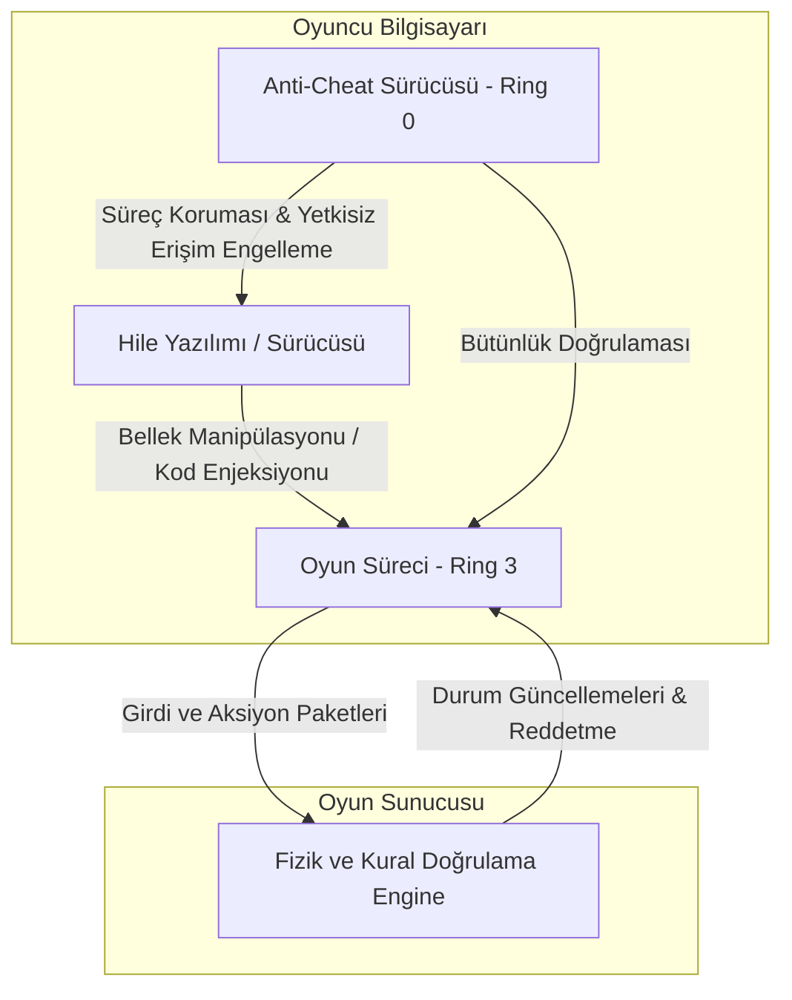
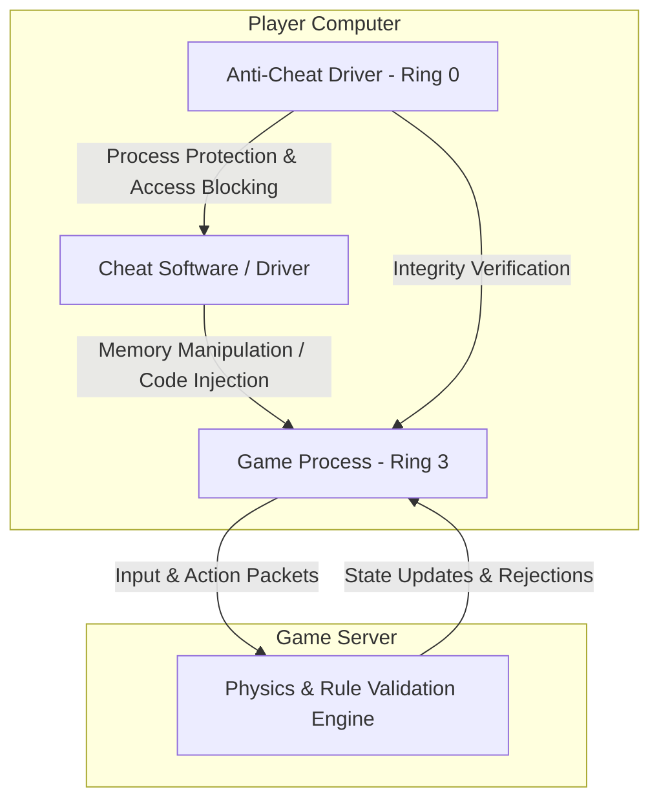

## Oyun Hileleri Nasıl Çalışır ve Nasıl Engellenir? (TR)

Rekabetçi oyun dünyasında hile ve dürüst oyun (fair play) arasındaki savaş, siber güvenliğin en dinamik ve teknik açıdan en zorlu cephelerinden biridir. Bir zamanlar sadece basit RAM değerlerini değiştirmekten ibaret olan hileler, günümüzde işletim sisteminin en yetkili katmanlarında çalışan karmaşık yazılımlara dönüşmüştür. Peki bu hileler arka planda nasıl çalışıyor ve modern güvenlik sistemleri onları nasıl tespit edip engelliyor?

### Hilelerin Teknik Anatomisi

Oyun hilelerinin temel amacı, oyun istemcisinin (client) bilgisayarda sahip olduğu verilere yetkisiz erişim sağlamak ve bu verileri manipüle etmektir. En yaygın hile türlerinin arkasında yatan matematik ve sistem mühendisliği şu şekildedir:

#### 1. Wallhack ve ESP (Extra Sensory Perception)
Wallhack ve ESP hileleri, oyuncunun normal şartlarda görmemesi gereken nesneleri (duvar arkasındaki düşmanlar, tuzaklar, değerli eşyalar) görmesini sağlar. 
*   **Bellek Okuma (Memory Reading):** Oyun istemcisi, haritadaki tüm oyuncuların koordinatlarını (X, Y, Z konumları) belleğinde (RAM) tutmak zorundadır. ESP yazılımı, oyunun bellek adres haritasını çıkararak bu koordinatları sürekli olarak okur.
*   **Dünyadan Ekrana Matematiksel İzdüşüm (World-to-Screen):** Bellekten okunan 3 boyutlu koordinat verileri, oyuncunun baktığı açı ve kamera matrisi kullanılarak 2 boyutlu ekran koordinatlarına dönüştürülür. Hile yazılımı, oyunun üzerine saydam bir katman (overlay) çizerek bu koordinatlara kutular, can barları veya isimler yerleştirir.

#### 2. Aimbot ve Bakış Açısı Manipülasyonu
Aimbot, oyuncunun nişangahını otomatik olarak düşmanın üzerine kilitler.
*   **Açı Hesaplama:** Hile yazılımı, oyuncunun kendi koordinatları ile en yakın düşmanın koordinatları arasındaki vektörü hesaplar. Bu vektörden yola çıkarak dikey (pitch) ve yatay (yaw) bakış açılarını bulur.
*   **Bakış Açısı (ViewAngle) Yazımı:** Hesaplanan yeni açılar, oyunun bellek alanındaki `ViewAngle` yapısının üzerine doğrudan yazılır veya fare hareketlerini simüle eden Windows API çağrıları (örneğin `SendInput`) ile nişangah düşmana yönlendirilir.

#### 3. Kod Enjeksiyonu ve Fonksiyon Kancalama (Hooking)
Hileler oyunun çalışma mantığını değiştirmek için oyuna harici bir kod kütüphanesi (DLL) enjekte eder. Enjekte edilen bu kod, oyun motorunun DirectX veya OpenGL gibi grafik çizim fonksiyonlarını kancalar (hook). Örneğin, duvar arkasındaki modellerin çizilmesini sağlayan grafik motoru çağrılarındaki derinlik testini (Z-buffer) devre dışı bırakarak modelleri duvarların önünde çizer (Chams hilesi).

---

### Hile Engelleme (Anti-Cheat) Mekanizmaları

Hilelerin bu gelişmiş yöntemlerine karşı oyun geliştiricileri de savunma sistemlerini evrimleştirmiştir. Güvenlik önlemleri temelde üç ana başlıkta toplanır:

#### 1. Kernel Seviyesi (Ring 0) Anti-Cheat Sürücüleri
Geleneksel anti-cheat yazılımları kullanıcı modunda (Ring 3) çalışırdı. Ancak hile geliştiricileri, Windows çekirdeğinde (kernel) çalışan sürücüler (Ring 0) yazarak Ring 3'teki güvenlik yazılımlarının kendi bellek alanlarını görmesini tamamen engellediler. Buna karşılık olarak Riot Vanguard ve Easy Anti-Cheat gibi modern korumalar da artık Ring 0 seviyesinde çalışmaktadır.
*   Kernel sürücüleri, işletim sistemi çekirdeğine doğrudan erişerek oyun belleğine yönelik tüm handle açma girişimlerini (`ObRegisterCallbacks` ile) denetler ve yetkisiz bellek okuma/yazma isteklerini engeller.
*   Sistemdeki imzasız veya şüpheli sürücülerin yüklenmesini engeller.

#### 2. Davranışsal ve Sezgisel Analiz (Heuristics)
İstemci tarafındaki güvenlik ne kadar yüksek olursa olsun, hileciler donanımsal çözümlerle (örneğin fare sinyallerini manipüle eden harici donanımlar - DMA kartları) bellek korumalarını aşabilir. Bu durumda devreye davranışsal analiz girer.
*   **İnsan Limitlerinin Analizi:** Oyuncunun nişan alma hareketlerinin doğrusal pürüzsüzlüğü, mikro düzeydeki titremeler ve tepki süreleri analiz edilir. Bir insanın fiziksel olarak yapamayacağı mükemmellikteki milisaniyelik kilitlenmeler yapay zeka modelleri tarafından anında tespit edilir.

#### 3. Sunucu Taraflı Doğrulama (Server-Side Validation)
Hile mühendisliğinin altın kuralı şudur: **"İstemciye asla güvenme."** Oyun içi fizik kuralları, hız limitleri ve mermi isabetleri istemcinin bilgisayarında değil, sunucuda hesaplanmalıdır. Sunucu, istemcinin "Işınlandım" veya "Duvarın arkasından vurdum" gibi taleplerini kendi fizik motorunda simüle ederek reddeder.

Hile geliştiricileri ve anti-cheat mühendisleri arasındaki bu kedi-fare oyunu, işletim sistemi mimarilerinin sınırlarını zorlamaya devam etmektedir.

---

## How Game Cheats Work & How They Are Blocked (EN)

The war between cheats and fair play in competitive gaming represents one of the most dynamic and technically challenging battlefronts in cybersecurity. Cheats, which once consisted of simple RAM value alterations, have evolved into highly sophisticated software operating at the highest privilege levels of the operating system. How do these cheats work under the hood, and how do modern security systems detect and prevent them?

### The Technical Anatomy of Game Cheats

The primary objective of a game cheat is to gain unauthorized access to and manipulate the data that the game client processes on the local machine. The mathematics and system engineering behind the most common cheat types are detailed below:

#### 1. Wallhacks and ESP (Extra Sensory Perception)
Wallhacks and ESP cheats allow players to perceive elements (such as enemies behind walls, traps, or valuable loot) that should remain hidden under normal gameplay conditions.
*   **Memory Reading:** The game client must store the coordinates (X, Y, Z positions) of all active entities in the local virtual memory (RAM). ESP software maps these memory structures and continuously reads these coordinate offsets.
*   **World-to-Screen Projection:** The 3D coordinate data retrieved from memory is mathematically projected onto the 2D screen coordinate space using the player's current field of view (FOV) and camera transformation matrix. The cheat software then draws overlays (bounding boxes, health bars, or names) on a transparent window layer on top of the game.

#### 2. Aimbots and ViewAngle Manipulation
An aimbot automatically aligns the player's crosshair with an opponent.
*   **Angle Calculation:** The cheat calculates the direction vector between the local player and the targeted enemy coordinates. Using trigonometry, it computes the target yaw (horizontal angle) and pitch (vertical angle).
*   **ViewAngle Modification:** These calculated angles are either written directly to the game process's `ViewAngle` memory structure, or simulated via OS input APIs (like Windows' `SendInput`) to rapidly snap the crosshair onto the target.

#### 3. Code Injection and Function Hooking
To modify game logic dynamically, cheats inject a custom dynamic-link library (DLL) into the game process space. This injected code hooks critical game engine functions, such as DirectX or OpenGL rendering calls. For instance, by overriding the depth test (Z-buffer) parameter in rendering functions, player models are drawn on top of walls (commonly known as Chams).

---

### Anti-Cheat Defense Mechanisms

To counter these advanced exploit vectors, game developers have engineered sophisticated defensive suites. Security measures generally span three primary pillars:

#### 1. Kernel-Level (Ring 0) Anti-Cheat Drivers
Traditional anti-cheat software ran in user mode (Ring 3). However, cheat developers bypassed user-mode detections by deploying kernel drivers (Ring 0), which can fully hide their memory operations from Ring 3 processes. In response, modern anti-cheats like Riot Vanguard and Easy Anti-Cheat operate at Ring 0.
*   **Kernel-Level Interception:** Kernel drivers monitor all process handle creations using kernel callbacks (e.g., `ObRegisterCallbacks`) to block unauthorized memory read/write requests from other processes.
*   **Driver Signature Enforcement:** They prevent unsigned or vulnerable third-party drivers from loading into the system, neutralizing kernel-mode exploit templates.

#### 2. Behavioral and Heuristic Analysis
Even if client-side software security is airtight, hackers can bypass memory-level monitoring using hardware-based solutions, such as Direct Memory Access (DMA) cards that read RAM directly via PCIe slots. This is where behavioral analysis comes in.
*   **Physical Limitations Analysis:** Security engines analyze telemetry data like mouse movement trajectory linearity, micro-adjustments, and human reaction speeds. Snaps to target that exhibit sub-millisecond speeds or perfect tracking without deceleration are immediately flagged as anomalous by machine learning models.

#### 3. Server-Side Validation
The absolute golden rule of game engineering is: **"Never trust the client."** Game physics, maximum movement speeds, and projectile collisions must be processed or validated on the remote server. The server simulates the client's reported state transitions, instantly rejecting illegal behaviors such as teleportation or shooting through solid obstacles.

This endless cat-and-mouse game between cheat developers and anti-cheat engineers continues to drive the evolution of operating system architecture and real-time security systems.

---

*This post is linked to the Knowledge Base: [[Knowledge Base / game-security-and-cheats]]*
