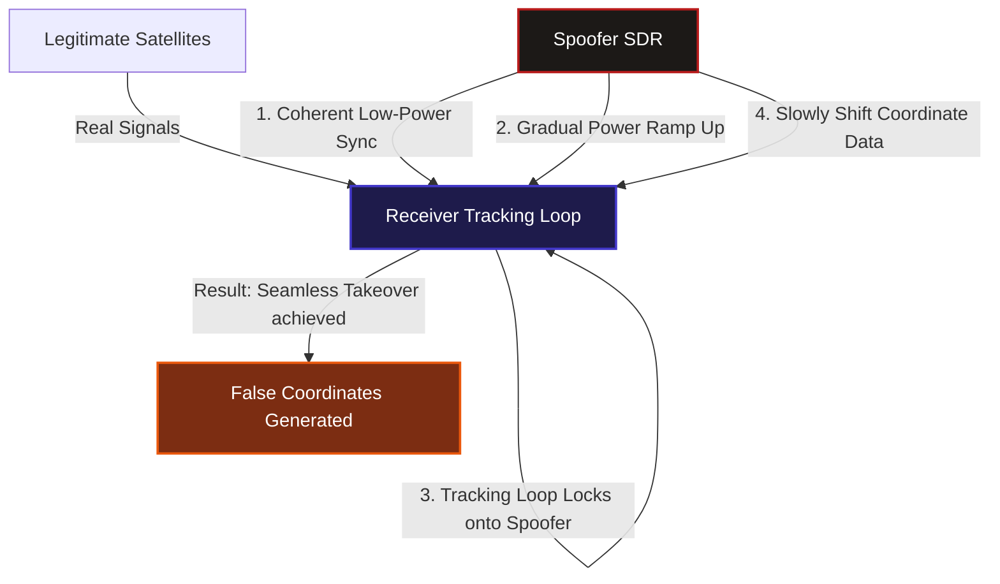
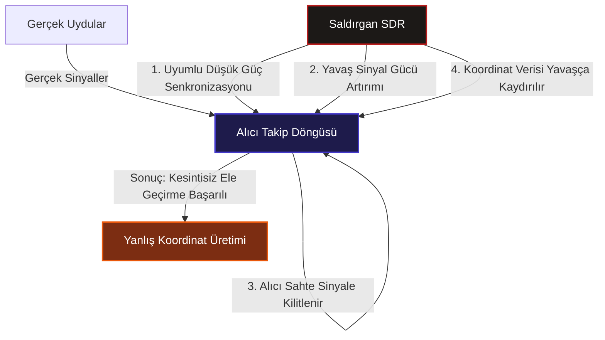

## English (EN)

### Introduction
Global Navigation Satellite Systems (GNSS), including GPS (USA), GLONASS (Russia), BeiDou (China), and Galileo (EU), are the backbone of modern global positioning, navigation, and time synchronization. From guiding container ships and autonomous drones to coordinating global financial markets and cellular network handovers, society depends deeply on precise satellite signals. However, civilian GNSS signals possess a critical security flaw: they are unencrypted and unauthenticated at the physical layer. This design choice makes them highly vulnerable to spoofing—an attack where a malicious transmitter broadcasts falsified satellite signals to trick a receiver into calculating a false position or time.

### Attack Objectives: Position vs. Time
GNSS spoofing does not just redirect vehicle courses. Attackers usually aim for one of three impacts:
1.  **Spatial Deviation (Incorrect Position)**: Forcing a receiver to calculate a false location. Drones can be diverted into restricted airspace or captured; cargo ships can be tricked into navigating into hostile territorial waters while reporting normal tracks.
2.  **Temporal Shift (Incorrect Time)**: GNSS satellites are equipped with highly precise atomic clocks, used worldwide to synchronize critical infrastructure. By shifting the timing signals, an attacker can desynchronize telecommunication towers, cause packet loss in high-frequency trading platforms, or disrupt power grid phase measurements, leading to massive infrastructure failures.
3.  **Disruption**: Simply flooding the GPS bands with garbage data to force the receiver to lose its lock, rendering GPS-based navigation entirely useless.

### Coherent vs. Non-Coherent Spoofing
The difficulty and effectiveness of a spoofing attack depend heavily on synchronization:

*   **Non-Coherent Spoofing**: The attacker generates a set of authentic-looking GPS signals but does not synchronize them with the real satellites currently in the sky. When the fake signal is transmitted at a higher power, the target receiver experiences a sudden jump in signal power and coordinate location, or temporarily loses its lock. This makes it relatively easy for anomaly detection algorithms to flag the attack.
*   **Coherent Spoofing (Seamless Takeover)**: The gold standard of electronic warfare. The attacker records the legitimate GPS signals and synthesizes a spoofed signal that is perfectly synchronized in time, phase, and power with the real satellites. The attacker starts at a lower power, matches the authentic signal, and then gradually raises the transmission power. Once the receiver's tracking loop locks onto the malicious signal, the attacker slowly shifts the coordinates, leading the receiver away without triggering any alarm.

### Detection and Mitigation
As Software Defined Radios (SDRs) have become cheaper and open-source spoofing tools more accessible, guarding civilian receivers is crucial:
*   **Galileo OS-NMA (Open Service Navigation Message Authentication)**: The European Galileo system is leading the way by adding cryptographic signatures to civilian navigation messages, letting receivers verify that the signal originated from a real satellite.
*   **Inertial Navigation System (INS) Fusion**: Modern autopilots combine GPS with gyroscopes and accelerometers. If GPS says the ship is moving west at 50 knots but inertial sensors detect no physical acceleration, the system rejects the GPS data.
*   **Multi-Antenna Arrays (Spatial Filtering)**: Checking the angle of arrival of incoming signals. Authentic GPS signals come from different directions in the sky, while spoofed signals usually originate from a single ground-based transmitter.

---

## Türkçe (TR)

### Giriş
Küresel Seyrüsefer Uydu Sistemleri (GNSS) – ABD'nin GPS'i, Rusya'nın GLONASS'ı, Çin'in BeiDou'su ve AB'nin Galileo'su dahil olmak üzere – modern dünyada konumlandırma, rota bulma ve zaman senkronizasyonunun temelini oluşturur. Kargo gemilerinin yönlendirilmesinden otonom İHA'ların uçuşuna, finansal borsaların işlem zaman damgalarından hücresel baz istasyonlarının senkronizasyonuna kadar devasa bir altyapı bu uydulara bağlıdır. Ancak sivil uydulardan gönderilen GNSS sinyallerinin kritik bir güvenlik açığı vardır: Fiziksel katmanda şifrelenmemiş ve doğrulanmamıştır. Bu durum, sivil sinyalleri "spoofing" (yanıltma) saldırılarına karşı son derece savunmasız hale getirir. Saldırganlar sahte uydu sinyalleri yayınlayarak hedef alıcının yanlış konum veya zaman hesaplamasını sağlayabilir.

### Saldırı Hedefleri: Konum ve Zaman Manipülasyonu
GNSS yanıltması sadece rota değiştirmekle kalmaz, saldırganlar genellikle şu üç hedeften birini amaçlar:
1.  **Konum Saptırma (Yanlış Konum)**: Hedef alıcının (örneğin bir İHA veya gemi) kendisini farklı bir koordinatta sanmasını sağlamak. Bu yöntemle askeri İHA'lar sınır ihlali yapmaya zorlanabilir ya da kargo gemileri normal rota bildirdiğini sanırken düşman karasularına çekilebilir.
2.  **Zaman Kaydırma (Yanlış Zaman)**: Uydulardaki hassas atomik saatler, kritik altyapıların zaman senkronizasyonu için kullanılır. Saldırgan zaman sinyalini kaydırarak baz istasyonlarını devre dışı bırakabilir, yüksek frekanslı finansal borsalarda paket kayıpları yaratabilir veya elektrik şebekelerindeki faz ölçümlerini bozarak büyük kesintilere yol açabilir.
3.  **Hizmet Dışı Bırakma (Disruption)**: GPS frekans bandını tamamen gürültüyle doldurarak alıcının uydu bağlantısını koparmasını sağlamak ve sistemi GPS'siz bırakmak.

### Uyumlu (Coherent) ve Uyumsuz (Non-Coherent) Yanıltma
Bir yanıltma saldırısının başarısı ve fark edilebilirliği, sinyallerin senkronizasyon kalitesine bağlıdır:

*   **Uyumsuz (Non-Coherent) Yanıltma**: Saldırgan, uydulardan gelen gerçek sinyallerle hiçbir zaman veya güç eşleştirmesi yapmadan doğrudan daha güçlü sahte sinyaller yayınlar. Hedef alıcı bu güçlü sinyali aldığında ani koordinat sıçramaları yaşar veya bağlantıyı kısa süreliğine kaybedip tekrar bağlanır. Bu ani sıçramalar, alıcıdaki anomali tespit yazılımları tarafından kolayca yakalanır.
*   **Uyumlu (Coherent - Kesintisiz Ele Geçirme)**: Elektronik harbin en gelişmiş seviyesidir. Saldırgan, gökyüzündeki gerçek uydulardan gelen sinyalleri anlık izler ve zaman, faz ve güç açısından bunlarla kusursuz şekilde senkronize olmuş sahte sinyaller üretir. Sahte sinyal önce düşük güçle verilir, ardından yavaş yavaş gücü artırılarak alıcının takip döngüsü (tracking loop) hissettirilmeden sahte sinyale kilitlenir. Ele geçirme tamamlandıktan sonra koordinatlar milim milim kaydırılır; alıcı hiçbir alarm tetiklemeden yanlış konuma yönlendirilir.

### Savunma ve Korunma Yöntemleri
Yazılım Tanımlı Radyo (SDR) donanımlarının ucuzlaması ve açık kaynak kodlu GPS simülatörlerinin yaygınlaşması nedeniyle sivil alıcıların korunması kritik öneme sahiptir:
*   **Galileo OS-NMA (Açık Servis Seyrüsefer Mesajı Doğrulaması)**: Avrupa'nın Galileo uydu sistemi, sivil yayınlara kriptografik imzalar ekleyerek alıcıların bu sinyalin gerçek uydudan gelip gelmediğini doğrulamasına imkan tanımaktadır.
*   **Ataletsel Seyrüsefer Sistemleri (INS) Entegrasyonu**: Modern otopilotlar sadece GPS kullanmaz; jiroskop ve ivmeölçer verilerini birleştirir. Eğer GPS geminin 50 knot hızla gittiğini söylüyor ancak ivmeölçerler herhangi bir hareket algılamıyorsa, GPS verisi reddedilir.
*   **Çoklu Anten Dizileri (Spatial Filtering)**: Sinyallerin geliş açısını kontrol etmek. Gerçek uydu sinyalleri gökyüzünün farklı yönlerinden gelirken, yanıltma sinyalleri genellikle yerdeki tek bir saldırgan vericisinden gelir.

---

*This post is linked to the Knowledge Base: [[Knowledge Base / gnss-spoofing-and-takeover-attacks]]*
