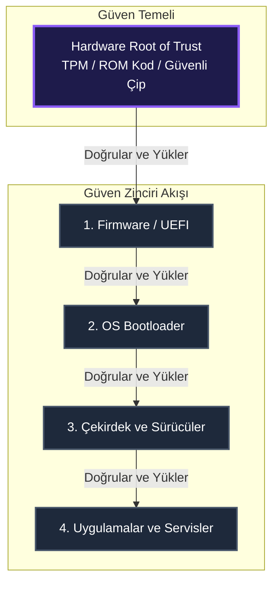
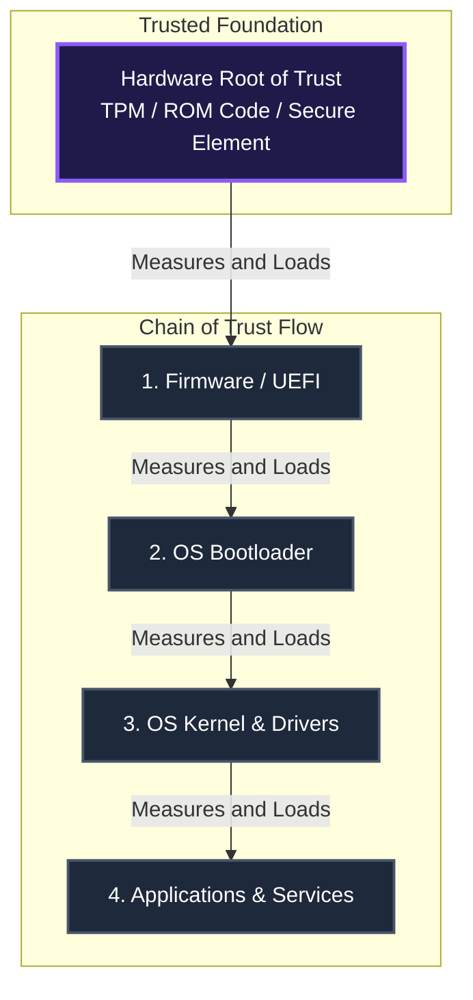

## Türkçe (TR)

### Giriş
Bir bilgisayar sisteminin güvenli olduğunu nasıl anlarsınız? Antivirüs yazılımları işletim sistemine, işletim sistemi çekirdeğe (kernel), çekirdek ise bootloader'a güvenir. Peki ama bootloader kime güvenir? Güvenlik mimarilerinde bu döngüsel güven zincirini kırmak ve sistemi sarsılmaz bir temel üzerine inşa etmek için **Donanım Güven Kökü (Hardware Root of Trust - RoT)** kullanılır. Donanım güven kökü, sistemin en alt basamağında yer alan, kendi doğruluğu üst katmanlar tarafından denetlenemeyen ancak tüm sistemin doğruluğunu kontrol eden, doğası gereği "güvenilir" kabul edilen fiziksel bir bileşendir.

### Donanım Güven Kökünün Üç Temel İşlevi
Bir donanım güven kökü, sistemin güvenliğini sağlamak için üç ana işlevi yerine getirir:
1.  **Ölçüm (Root of Trust for Measurement - RTM)**: Sistem önyükleme yaparken (boot aşamasında) çalıştırılacak olan her bir yazılım bileşeninin (firmware, bootloader, kernel) kriptografik özetini (hash) hesaplayarak kayıt altına alır.
2.  **Depolama (Root of Trust for Storage - RTS)**: Kriptografik anahtarları, sertifikaları ve sistem bütünlük ölçümlerini (PCR - Platform Configuration Registers) dışarıdan okunamayacak veya değiştirilemeyecek şekilde zırhlı belleklerde saklar.
3.  **Raporlama (Root of Trust for Reporting - RTR)**: Sistem durumunun bütünlüğünü gösteren verileri kendi özel anahtarıyla (Endorsement Key) imzalayarak üçüncü taraflara sunar. Bu sürece **Uzaktan Kanıtlama (Remote Attestation)** denir.

### Güven Zinciri (Chain of Trust)
Bir sistem açılırken donanım güven kökü, bir sonraki yazılım adımını doğrular ve kontrolü ona devreder. Bu adım bir sonrakini doğrular ve bu süreç uygulamalara kadar uzanır. Aşağıdaki hiyerarşik şemada, donanım güven kökü ile başlayan Güven Zinciri'nin yapısı gösterilmiştir:

### Gerçek Dünyadaki Uygulamaları
*   **TPM (Trusted Platform Module)**: Bilgisayarların anakartları üzerinde yer alan özel bir mikrodenetleyicidir. TPM 2.0 standardı, Windows 11'in temel gereksinimlerinden biri olup BitLocker disk şifreleme anahtarlarını korumak ve güvenli önyüklemeyi doğrulamak için kullanılır.
*   **HSM (Hardware Security Module)**: Veri merkezlerinde kullanılan, saniyede binlerce imzalama ve şifreleme işlemi yapabilen yüksek performanslı, fiziksel saldırılara karşı duyarlı cihazlardır. Üzerindeki fiziksel koruma kapakları açıldığında içindeki anahtarları anında yok edecek şekilde tasarlanmışlardır.
*   **Secure Element (SE) & Secure Enclave**: Akıllı telefonlarda (Apple Secure Enclave, Samsung Knox) ve kredi kartlarında kullanılan, dış dünyadan tamamen izole edilmiş mini bilgisayar çipleridir. Biyometrik verilerinizi (FaceID, parmak izi) ve ödeme anahtarlarınızı saklarlar.

Donanım güven kökünün kritik yönü, donanıma gömülü olmasıdır. Eğer donanım düzeyinde bir arka kapı veya Truva Atı (Hardware Trojan) mevcutsa, üzerindeki tüm yazılımlar ne kadar güvenli olursa olsun, güvenlik zinciri en temelden kırılmış olur.

---

## English (EN)

### Introduction
How do you verify that a computer system is secure? Antivirus programs trust the operating system, the operating system trusts the kernel, and the kernel trusts the bootloader. But who does the bootloader trust? To break this circular dependency and build security on an unshakeable foundation, security architects use a **Hardware Root of Trust (RoT)**. A Hardware RoT is a physical component at the lowest layer of a system's architecture that is inherently trusted. Because it sits at the bottom, its own integrity cannot be checked by the layers above it; instead, it serves as the ultimate anchor for all verification processes.

### Three Core Functions of an RoT
A Hardware Root of Trust performs three primary functions to establish system-wide security:
1.  **Measurement (Root of Trust for Measurement - RTM)**: As the system boots, the RoT calculates cryptographic hashes of each subsequent software component (firmware, bootloader, kernel) before they execute, recording an immutable log of the boot sequence.
2.  **Storage (Root of Trust for Storage - RTS)**: It holds cryptographic keys, certificates, and system measurements (such as PCRs) in secure, hardware-shielded memory that cannot be accessed or modified by external software.
3.  **Reporting (Root of Trust for Reporting - RTR)**: It cryptographically signs the recorded measurements using its unique private key (e.g., Endorsement Key). This allows remote verifiers to inspect the platform state—a process known as **Remote Attestation**.

### The Chain of Trust
During a secure boot process, the Hardware RoT measures and verifies the integrity of the firmware. The firmware then measures and verifies the bootloader, which in turn verifies the operating system kernel. This unbroken sequence is called the Chain of Trust, visualized in the hierarchy below:

### Real-world Implementations
*   **TPM (Trusted Platform Module)**: A dedicated microcontroller chip on a computer motherboard. The modern TPM 2.0 standard is a baseline requirement for Windows 11, protecting BitLocker disk encryption keys and verifying boot integrity.
*   **HSM (Hardware Security Module)**: High-performance, highly secure devices used in datacenters to perform cryptographic operations. HSMs are tamper-resistant; they feature physical security boundaries that immediately erase cryptographic secrets if the module is physically opened.
*   **Secure Element (SE) & Secure Enclave**: Ultra-secure chips used in smart cards, SIM cards, and modern smartphones (such as Apple's Secure Enclave). They run a completely separate micro-OS to process face metrics, fingerprint templates, and payment details without exposing them to the main operating system.

Because the Root of Trust is built into the physical silicon, it represents the absolute boundary of system security. If the hardware itself is compromised—for instance, by a malicious modification during manufacturing (Hardware Trojan)—the entire trust chain above it collapsed, regardless of how secure the operating system and applications are.

---

*This post is linked to the Knowledge Base: [[Knowledge Base / hardware-root-of-trust]]*
