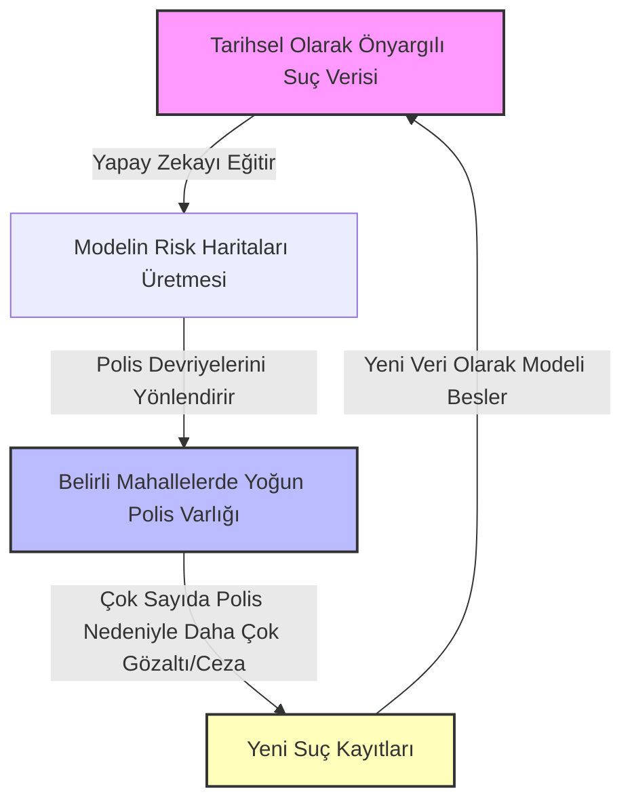
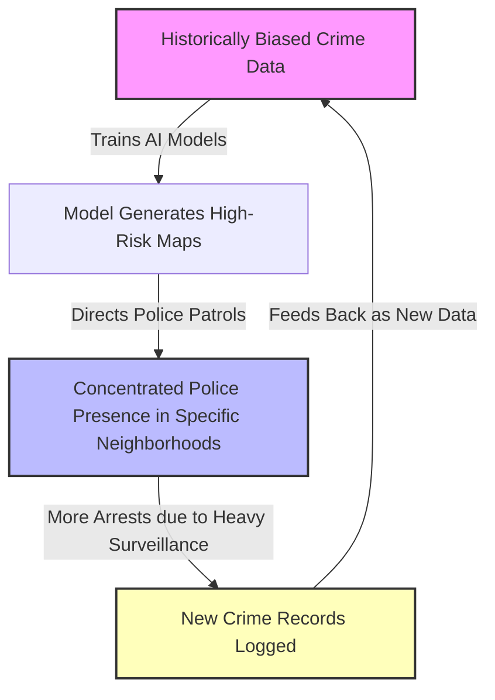

# (TR) Geleceğin Suçunu Tahmin Etmek: Predictive Policing ve Algoritmik Önyargı

2002 yapımı ünlü bilimkurgu filmi *Minority Report (Azınlık Raporu)*, suçları henüz işlenmeden önce öngören ve katilleri cinayetten önce tutuklayan fütüristik bir polis birimini konu alıyordu. Film yayınlandığında bu konsept uzak bir hayal gibi görünse de, bugün **Predictive Policing (Öngörücü Kolluk / Tahminci Polislik)** adı verilen yapay zeka ve veri analitiği sistemleriyle bu hayal büyük oranda gerçeğe dönüştü.

Peki, suç dalgalarını önceden tahmin eden bu algoritmalar ne kadar adil? Veri bilimi adalet dağıtırken nasıl bir ayrımcılık aracına dönüşebilir? Bu yazımızda, tahminci polislik teknolojilerini, arkasındaki algoritmaları ve bu sistemlerin yarattığı derin etik sorunları inceliyoruz.

---

## Predictive Policing Nedir ve Nasıl Çalışır?

Tahminci polislik, suç faaliyetlerini önceden belirlemek ve önlemek amacıyla geçmiş suç verilerini, sosyal medya aktivitelerini, hava durumunu, hatta sismik tahmin algoritmalarını harmanlayarak analiz eden bir yöntemdir. Genel olarak iki farklı metodoloji ile karşımıza çıkar:

### 1. Konum Tabanlı Tahminler (Place-based Predictive Policing)
Bu yaklaşım, suçun **nerede ve ne zaman** işleneceğini tahmin etmeye odaklanır. En popüler yazılımlardan biri olan **PredPol (Geolitica)**, deprem artçı şoklarını tahmin etmek için kullanılan sismolojik modelleri temel alır. Tıpkı bir depremin ardından belirli bölgelerde artçı sarsıntıların beklenmesi gibi, bir suç işlendiğinde de o bölgenin yakınlarında kısa sürede yeni suçların işlenme olasılığının arttığı varsayılır. Sistem, her gün polislere devriye gezmeleri gereken 150x150 metrelik "sıcak noktaları" (hot spots) gösteren kırmızı kutucuklu haritalar üretir.

### 2. Kişi Tabanlı Tahminler (Person-based Predictive Policing)
Bu yaklaşım ise doğrudan **kimin** suç işleme veya bir suça kurban gitme olasılığının yüksek olduğunu tahmin etmeyi amaçlar. Örneğin, Chicago Polis Departmanı tarafından kullanılan **Strategic Subject List (SSL - Stratejik Süje Listesi)**, kişileri sabıka kayıtları, sosyal ağ ilişkileri, silahla vurulma geçmişleri gibi değişkenlere dayanarak 1 ile 500 arasında bir risk skoruyla derecelendiriyordu. Bu sistemde yüksek risk grubundaki kişilere suç işlemeden önce uyarı ziyaretleri gerçekleştiriliyordu.

---

## Teknolojinin Arkasındaki Matematik

Tahmin modelleri rastgele tahminler yapmaz; arkalarında gelişmiş istatistiksel modeller bulunur:
* **Point Process Models (Noktasal Süreç Modelleri):** Olayların zaman ve mekan içindeki dağılımını analiz eder. Sismik hareket tahminlerinde kullanılan *Hawkes Süreci (Hawkes Process)* self-exciting (kendi kendini tetikleyen) bir matematiksel model olup suçun yayılımını modellemek için de sıkça kullanılır.
* **Kernel Density Estimation (KDE):** Geçmiş suç verilerinin mekansal yoğunluğunu hesaplayarak pürüzsüz suç yoğunluk haritaları oluşturur.
* **Risk Terrain Modeling (RTM):** Sadece suç verilerini değil, suçun zemin hazırlayıcısı olabilecek fiziksel mekanları (örneğin tekin olmayan sokaklar, tekel bayileri, metruk binalar) harita üzerinde analiz ederek risk alanlarını belirler.

---

## En Büyük Tehlike: Algoritmik Geri Besleme Döngüsü (Feedback Loop)

Tahminci polislik sistemlerine yöneltilen en büyük teknik ve etik eleştiri, sistemin kendi kendini doğrulayan bir kehanete, yani bir **geri besleme döngüsüne** yol açmasıdır. 

Yapay zeka modelleri "objektif" suç oranlarını değil, sadece polise yansıyan ve kayda geçen suç verilerini öğrenir. Bu durum aşağıdaki tehlikeli döngüyü tetikler:

Bu döngüde algoritma, polisin zaten sıkça gittiği ve tarihsel önyargılar nedeniyle aşırı denetlenen yoksul veya azınlık mahallelerini sürekli "yüksek riskli" olarak göstermeye devam eder. Sonuçta, algoritmanın tahmini "suç oranını" değil, **polisin gelecekte nereyi denetleyeceğini** tahmin etmekten öteye gidemez.

---

## Etik ve Hukuki Dilemler

1. **"Masumiyet Karinesi"nin Zedelenmesi:** Kişi tabanlı tahmin algoritmaları, bireyleri henüz işlemedikleri bir suçun potansiyel şüphelisi haline getirir. Bu durum, anayasal bir hak olan masumiyet karinesini açıkça ihlal eder.
2. **Kara Kutu (Black Box) ve Şeffaflık Eksikliği:** Kolluk kuvvetlerinin kullandığı bu yazılımların büyük kısmı özel şirketler tarafından geliştirilmiştir. Şirketler ticari sır gerekçesiyle algoritmaların kaynak kodlarını ve hangi değişkenleri nasıl ağırlıklandırdıklarını kamuoyuyla paylaşmaz. Şeffaf olmayan bir sistemle adalet dağıtılması demokratik denetimi imkansız kılar.
3. **Ayrımcılığın Yapay Zeka ile Meşrulaştırılması:** İnsanların sahip olduğu ırksal, sınıfsal veya sosyo-ekonomik önyargılar veri setlerine sızdığında, yapay zeka bu önyargıları "bilimsel ve matematiksel gerçeklermiş" gibi sunarak ayrımcılığı otomatikleştirir ve meşrulaştırır.

## Gelecek ve Çözüm Arayışları

Predictive policing tamamen yasaklanmalı mıdır, yoksa ıslah edilebilir mi? Bugün Boston, San Francisco ve New Orleans gibi dünya genelindeki birçok büyük şehir bu yazılımların kullanımını tamamen yasaklamış durumdadır. Ancak sistemlerin devam ettiği bölgelerde şu çözümler üzerinde durulmaktadır:
* **Bağımsız Algoritma Denetimleri:** Yapay zeka sistemlerinin tarafsız veri mühendisleri ve insan hakları örgütleri tarafından düzenli olarak denetlenmesi.
* **Yalnızca Konum Odaklılık:** Kişi tabanlı risk puanlamalarının tamamen kaldırılması ve yalnızca suçun türü/zamanı gibi demografik olmayan verilere odaklanılması.
* **İnsan-Merkezli (Human-in-the-Loop) Karar Mekanizmaları:** Algoritma çıktılarının mutlak bir emir değil, yalnızca ikincil bir tavsiye olarak kabul edilmesi.

Geleceğin güvenli şehirlerini inşa ederken güvenliği sağlamak uğruna adaleti ve insan haklarını feda etmek, yapay zekanın insanlığa getireceği en büyük distopyalardan biri olabilir. Algoritmaların bizi korurken aynı zamanda bizi sınıflandırmadığı ve cezalandırmadığı bir dengeyi bulmak hayati önem taşımaktadır.

---

# (EN) Predicting Future Crimes: Predictive Policing and Algorithmic Bias

The famous 2002 sci-fi film *Minority Report* featured a futuristic police division called "Precrime" that predicted crimes before they happened and arrested killers before they committed murder. While this concept seemed like a distant dream when the movie was released, today it has largely become a reality through artificial intelligence and predictive analytics systems known as **Predictive Policing**.

But how fair are these algorithms that forecast crime waves? How can data science turn into a tool of systemic discrimination while attempting to deliver justice? In this post, we analyze predictive policing technologies, the mathematical models behind them, and the deep ethical dilemmas they introduce.

---

## What is Predictive Policing and How Does It Work?

Predictive policing is a method that aggregates and analyzes historical crime logs, social media activity, weather patterns, and even seismological algorithms to forecast and prevent criminal activity. It generally operates on two distinct methodologies:

### 1. Place-Based Predictions
This approach focuses on predicting **where and when** a crime is likely to occur. One of the most popular software tools, **PredPol (now Geolitica)**, is built on seismological mathematical models used to predict earthquake aftershocks. The underlying assumption is that, much like how aftershocks cluster in time and space after an initial earthquake, criminal activity tends to cluster near a recently committed crime. The system generates map overlays containing 150x150 meter "hot spots" highlighting red boxes where officers should patrol.

### 2. Person-Based Predictions
This approach aims to predict **who** is most likely to commit a crime or become a victim of one. For instance, the **Strategic Subject List (SSL)**, formerly used by the Chicago Police Department, assigned individuals a risk score ranging from 1 to 500 based on arrest history, social network analysis, and past gunshot victimization. Individuals flagged in the high-risk tiers were subjected to pre-emptive warning visits by police officers.

---

## The Mathematics Behind the Technology

Predictive policing models do not make random guesses; they rely on established statistical frameworks:
* **Point Process Models:** These model the occurrence of events in time and space. The *Hawkes Process*, a self-exciting mathematical model originally used in geophysics, is frequently adapted to model the contagion-like spread of property crime.
* **Kernel Density Estimation (KDE):** Evaluates the spatial density of past incidents to generate smooth, continuous crime heatmaps.
* **Risk Terrain Modeling (RTM):** Goes beyond historical crime locations by analyzing physical risk factors in the urban landscape—such as poorly lit alleyways, abandoned buildings, or certain businesses—to project future risk zones.

---

## The Major Threat: The Algorithmic Feedback Loop

The most severe technical and ethical criticism leveled at predictive policing is its tendency to create a self-fulfilling prophecy, known as an **algorithmic feedback loop**.

Machine learning models do not learn the actual, objective crime rates of a city; they only learn the crimes that are actively reported to, and recorded by, the police. This creates a dangerous loop:

In this cycle, the algorithm continuously marks low-income or minority neighborhoods as "high risk" simply because police officers have historically spent more time patrolling and making arrests in those areas. Ultimately, the algorithm's prediction ceases to forecast objective crime rates and instead merely predicts **where police officers will go next**.

---

## Ethical and Legal Dilemmas

1. **Erosion of the "Presumption of Innocence":** Person-based risk algorithms turn citizens into potential suspects for crimes they have not yet committed. This directly undermines the constitutional principle of the presumption of innocence.
2. **The Black Box and Lack of Transparency:** Most predictive policing systems are developed by private, for-profit tech firms. Under the guise of protecting proprietary source code and trade secrets, these companies refuse to disclose their algorithms, weighting variables, or training methods to public defenders, courts, or independent researchers.
3. **Automating and Legitimizing Systemic Bias:** When human prejudices (racial, socioeconomic, or geographic) are baked into historical datasets, the AI presents these biases as objective "mathematical facts." This sanitizes and automates discrimination under the banner of objective science.

## The Path Forward and Solutions

Should predictive policing be banned entirely, or can it be reformed? Many major global cities, including Boston, San Francisco, and New Orleans, have already enacted complete bans on the technology. However, in regions where these systems remain active, proposed reforms include:
* **Independent Algorithmic Audits:** Mandatory, regular auditing of AI systems by independent, third-party data scientists and civil liberties organizations.
* **Exclusive Focus on Geography (De-individuation):** Banning person-based risk scoring entirely and restricting algorithms to demographic-free spatial data (e.g., location, time, and type of property crime).
* **Human-in-the-Loop Decision Making:** Ensuring that algorithmic outputs are treated strictly as secondary suggestions rather than absolute operational mandates.

As we engineer the smart cities of the future, sacrificing justice and human rights in the name of efficiency could lead to one of the greatest technological dystopias of our time. Striking a balance where algorithms protect us without categorizing or prejudging us remains one of the critical challenges of modern society.

---

*This post is linked to the Knowledge Base: [[Knowledge Base / predictive-policing]]*
