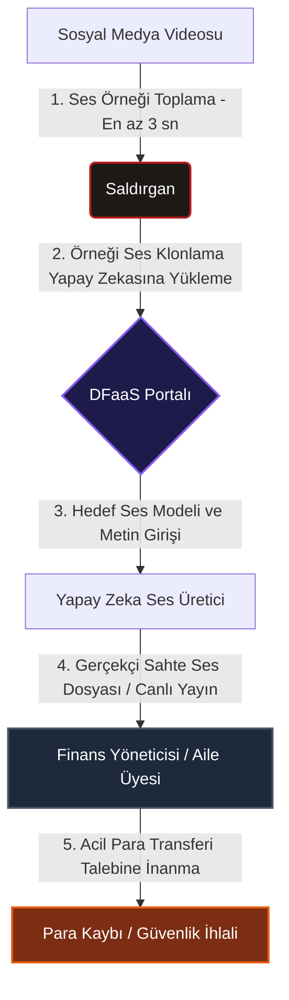
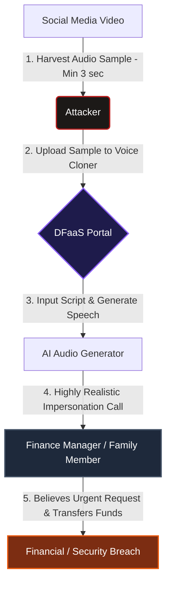

## Türkçe (TR)

### Giriş
Yapay zeka teknolojilerinin, özellikle de üretken yapay zekanın (Generative AI) inanılmaz bir hızla gelişmesi, hayatımıza birçok kolaylık getirdi. Ancak bu gelişme, siber saldırganların elinde son derece tehlikeli bir silaha dönüştü: **Deepfake ve Sentetik Kimlik Dolandırıcılığı**. Eskiden yalnızca büyük bütçeli Hollywood stüdyolarının yapabildiği ses ve yüz taklitleri, günümüzde artık **Hizmet Olarak Deepfake (Deepfake-as-a-Service - DFaaS)** platformları sayesinde internete bağlı herkesin, hatta hiçbir teknik bilgisi olmayan dolandırıcıların dahi birkaç saniye içinde üretebildiği sıradan bir araç haline geldi. 

### Günlük Hayattaki En Büyük Tehditler
Deepfake teknolojisi siber suç pazarında endüstriyelleşti ve günlük yaşantımızı doğrudan etkileyen yeni dolandırıcılık yöntemleri türetti:

1.  **Gerçek Zamanlı (Canlı) Deepfake**: Zoom, Microsoft Teams veya görüntülü WhatsApp aramaları sırasında saldırganlar kendi yüzlerini ve seslerini anlık olarak bir başkasınınkiyle (örneğin şirket CEO'su veya bir aile üyesi) değiştirebiliyor. Bu yöntemle şirketlerden milyonlarca liralık sahte transfer onayları alınabiliyor.
2.  **Ses Klonlama ile Oltalama (Voice-Cloning)**: Sosyal medyada paylaştığınız sadece **3 saniyelik** bir konuşma kaydı, yapay zekanın sesinizi birebir taklit etmesi için yeterlidir. Dolandırıcılar bu ses kopyasıyla anne, baba veya eşinizi arayıp, acil bir kaza veya kriz anında olduğunuzu söyleyerek para talep edebiliyor.
3.  **Hazır Sentetik Kimlik Paketleri**: Karanlık webde (dark web) yaklaşık 5 dolar gibi komik ücretlere satılan bu hazır paketler; sahte kimlik kartı görselleri, ses klonları ve sosyal medya hesap profillerini içerir. Dolandırıcılar bu paketleri kullanarak bankalarda sahte hesaplar açıp kara para aklayabiliyor.

### Deepfake ile Ses Klonlama Saldırısı Nasıl Gerçekleşir?
Aşağıdaki diyagramda, sosyal medyadan toplanan kısa bir ses örneğinin yapay zeka aracılığıyla klonlanıp bir finans yöneticisini hedef alan sosyal mühendislik saldırısına dönüştürülme süreci gösterilmektedir:

### Kendimizi Nasıl Koruyabiliriz?
Yapay zekanın bu karanlık yüzüne karşı hem bireysel hem de kurumsal olarak alabileceğimiz önlemler şunlardır:
*   **Güvenli Parola Kelimeleri (Safe Words)**: Aile üyelerinizle aranızda sadece sizin bilebileceğiniz gizli bir "acil durum şifresi" belirleyin. Şüpheli ve acil para talebi içeren bir arama aldığınızda bu şifreyi sorun. Ses klonlansa bile yapay zeka bu gizli kelimeyi bilemeyecektir.
*   **Canlılık Algılama (Liveness Detection)**: Kurumsal sistemlerde görüntülü görüşme ile kimlik doğrulaması yapılırken, karşıdaki kişinin gözünü kırpmasını, kafasını sağa sola çevirmesini veya kameraya yaklaşmasını isteyin. Gerçek zamanlı deepfake algoritmaları bu tür ani hareketlerde görsel bozulmalar yaşar.
*   **Çift Kanallı Doğrulama**: Yöneticinizden veya bir yakınınızdan gelen acil para isteklerinde, onları kayıtlı oldukları başka bir numaradan geri arayarak veya farklı bir mesajlaşma uygulaması üzerinden yazarak talebi mutlaka teyit edin.

---

## English (EN)

### Introduction
The rapid rise of generative artificial intelligence (GenAI) has brought incredible efficiency to our lives, making tasks easier and more intuitive. However, this same technology has become a dangerous weapon in the hands of cybercriminals: **Deepfake and Synthetic Identity Fraud**. What once required million-dollar Hollywood studios is now widely accessible via **Deepfake-as-a-Service (DFaaS)** portals. Today, anyone with an internet connection—including low-skilled scammers—can clone a voice or swap a face in a matter of seconds.

### The Rise of Generative AI Scams in Daily Life
Generative AI tools have industrialized the cybercrime market, giving rise to highly convincing everyday scams:

1.  **Live (Real-Time) Deepfakes**: Attackers can now overlay fake faces and mimic voices in real-time during live video calls on platforms like Zoom, Microsoft Teams, or WhatsApp. Scammers use this method to impersonate company executives and trick employees into authorizing large, unauthorized wire transfers.
2.  **Voice-Cloning Phishing**: A mere **3-second** audio clip of your voice—harvested from a public social media video—is enough for AI algorithms to clone your voice. Scammers use these clones to call family members, claiming that you are in an emergency or have been in an accident, to extort money.
3.  **Turnkey Synthetic Identity Kits**: Sold on dark web marketplaces for as little as $5, these kits provide scammers with pre-packaged synthetic IDs, matching voice clones, and fake social media profiles. These synthetic profiles are used to bypass bank KYC (Know Your Customer) checks and set up money-laundering accounts.

### Anatomy of an AI Voice-Cloning Attack
The following flowchart illustrates how a brief audio sample harvested from social media is processed by generative AI and turned into a targeted vishing (voice phishing) attack:

### Defensive Strategies: How to Protect Yourself
Guarding against AI-generated identity threats requires new habits and technologies:
*   **Establish Family Passphrases**: Set up a secret, offline emergency password or phrase with your family members. If you receive an urgent call from a loved one asking for money under distress, ask them to say the passphrase. Even the best voice clone cannot reveal a secret that has never been put online.
*   **Liveness Detection**: When verifying identity over video, look for visual anomalies. Ask the user to perform unexpected actions like blinking rapidly, turning their head sideways, or passing a hand in front of their face. Real-time face-swappers often fail or show noticeable distortions during these actions.
*   **Out-of-Band Verification**: If an executive or a family member contacts you with an urgent financial request, always hang up and call them back on their official, pre-registered number, or check with them via a completely different communication channel (e.g., SMS or another messaging app).

---

*This post is linked to the Knowledge Base: [[Knowledge Base / synthetic-identity-deepfakes]]*
